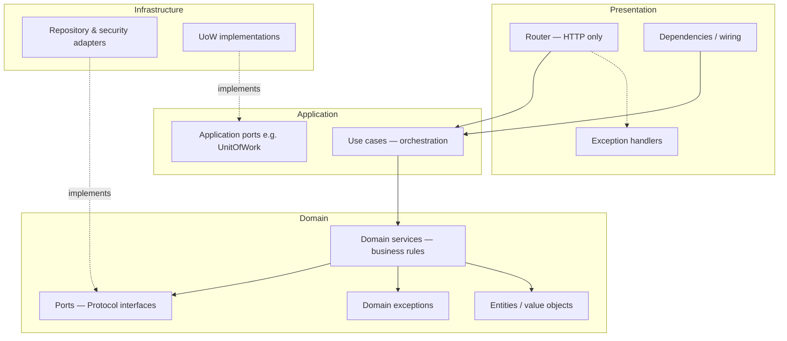

# VaultLog — Implementation Architecture

This document defines how we **build** VaultLog in code. It complements [VaultLogBook.md](VaultLogBook.md), which teaches security concepts, threat models, and product behavior chapter by chapter.

**VaultLogBook** is the source of truth for *what* to implement (Argon2id, rotating refresh tokens, RLS, MFA, encryption, audit, and so on). **This document** is the source of truth for *how* to structure that implementation: domain-driven design with hexagonal boundaries, thin application use cases, and domain services that own business rules.

When the book places SQLAlchemy queries, password checks, and token rotation inside a use case class, we implement the same behavior in a **domain service** and keep the use case as transaction orchestration only.

---

## 1. Goals

| Goal | How we achieve it |
|------|-------------------|
| Match VaultLogBook security semantics | Same algorithms, TTLs, RLS policies, and failure modes as each chapter |
| Clear separation of concerns | Each layer has one job; business rules live in the domain |
| Testability without a database | Domain services tested with in-memory `Protocol` fakes |
| Consistent pattern for new features | Every bounded context follows the same layout (identity is the reference) |
| Framework isolation | Domain never imports FastAPI, SQLAlchemy, or Pydantic |

---

## 2. Layered architecture

Dependencies point **inward**. Outer layers depend on inner abstractions, never the reverse.

```text
HTTP request
   |
   v
Presentation   (FastAPI routers, DTOs, cookies, dependency injection, exception → HTTP mapping)
   |
   v
Application    (use cases: open UoW, call domain service, commit/rollback)
   |
   v
Domain         (entities, value objects, domain services, ports, domain exceptions)
   |
   v
Infrastructure (SQLAlchemy, PostgreSQL, Argon2, JWT, KMS, Redis — adapters)
```



### Presentation (`src/vaultlog/presentation/`)

**Responsibility:** HTTP transport only.

- Parse and validate request bodies (Pydantic models).
- Map responses and status codes (via exception handlers, not inline `try/except` in routers).
- Set cookies, headers, and CORS-related behavior.
- Wire use cases and security adapters through FastAPI `Depends`.
- Never open database sessions, run queries, or encode business rules.

**Example:** [`backend/src/vaultlog/presentation/api/v1/auth.py`](backend/src/vaultlog/presentation/api/v1/auth.py) calls `LoginUser.execute(...)` and sets the refresh cookie. It does not verify passwords or rotate tokens.

### Application (`src/vaultlog/application/`)

**Responsibility:** Application workflow and transaction boundaries.

- One use case class per command (e.g. `RegisterUser`, `LoginUser`, `RefreshTokens`).
- Open the correct unit of work, construct the domain service with ports from the UoW, invoke one domain operation, commit.
- Do **not** contain domain rules (password policy, refresh reuse detection, membership resolution, etc.).

**Book vs this project:**

| VaultLogBook (Chapter 3) | VaultLog implementation |
|--------------------------|-------------------------|
| `LoginUser.execute` runs SQL, Argon2, session creation, JWT minting | `LoginUser.execute` opens `IdentityUnitOfWork`, calls `IdentityService.login`, commits |
| Use case is ~80 lines of business logic | Use case is ~15 lines of orchestration |

**Example:** [`backend/src/vaultlog/application/identity/use_cases.py`](backend/src/vaultlog/application/identity/use_cases.py)

Application ports (e.g. [`IdentityUnitOfWork`](backend/src/vaultlog/application/ports/identity_unit_of_work.py), [`UnitOfWork`](backend/src/vaultlog/application/ports/unit_of_work.py)) describe what the application needs from infrastructure without naming SQLAlchemy.

### Domain (`src/vaultlog/domain/`)

**Responsibility:** Business rules and language of the product.

Organize by **bounded context** (feature area), not by technical type at the repo root:

```text
domain/
  identity/          # auth, sessions, passwords (reference implementation)
  organizations/     # invitations, members, org views
  vaults/            # ...
  secrets/           # ...
  access/            # authorization vocabulary
  audit/             # ...
```

**Domain services** (e.g. [`IdentityService`](backend/src/vaultlog/domain/identity/services.py)) encapsulate multi-step rules that belong to one context:

- Registration: policy → email normalization → conflict check → user + org + membership.
- Login: credential verify (with timing equalization) → tenant resolution → session + refresh → access token.
- Refresh: `FOR UPDATE` lock → reuse detection → family revocation → rotation chain.
- Logout: idempotent session revoke.

**Ports** ([`domain/identity/ports.py`](backend/src/vaultlog/domain/identity/ports.py)) are `typing.Protocol` interfaces for anything the domain needs from the outside world:

- Persistence: `UserRepository`, `SessionRepository`, `RefreshTokenRepository`, …
- Security: `PasswordHasher`, `TokenIssuer`

The domain defines the interface; infrastructure provides the adapter. Unit tests provide fakes.

**Domain exceptions** are raised from services and value objects. They are **never** converted to HTTP inside the domain or application layers.

### Infrastructure (`src/vaultlog/infrastructure/`)

**Responsibility:** Technical details and external systems.

- SQLAlchemy models and repository adapters ([`repositories/identity.py`](backend/src/vaultlog/infrastructure/database/repositories/identity.py)).
- Unit of work implementations ([`SqlAlchemyUnitOfWork`](backend/src/vaultlog/infrastructure/database/unit_of_work.py), [`SqlAlchemyIdentityUnitOfWork`](backend/src/vaultlog/infrastructure/database/identity_unit_of_work.py)).
- Security adapters ([`Argon2Hasher`](backend/src/vaultlog/infrastructure/security/passwords.py), [`TokenService`](backend/src/vaultlog/infrastructure/security/tokens.py)).
- Engine/session factory setup ([`engine.py`](backend/src/vaultlog/infrastructure/database/engine.py)).

Infrastructure may import domain ports and models. It must not import presentation or use cases.

### Shared (`src/vaultlog/shared/`)

Cross-cutting, environment-specific configuration and logging ([`config.py`](backend/src/vaultlog/shared/config.py), [`logging.py`](backend/src/vaultlog/shared/logging.py)). Not a dumping ground for business logic.

---

## 3. Ports and adapters (hexagonal style)

We use **Protocol-based ports**, not abstract base classes, so fakes and mocks are trivial in tests.

```text
Domain port (Protocol)     Infrastructure adapter
─────────────────────     ────────────────────────
PasswordHasher            Argon2Hasher
TokenIssuer               TokenService (RS256 JWT + refresh helpers)
UserRepository            SqlAlchemyUserRepository
IdentityUnitOfWork        SqlAlchemyIdentityUnitOfWork
```

**Wiring** happens in presentation dependencies ([`presentation/dependencies.py`](backend/src/vaultlog/presentation/dependencies.py)): FastAPI constructs use cases with concrete adapters. Domain and application code only see Protocol types.

**Testing:**

- **Unit:** fake repositories + fake `TokenIssuer` → test [`IdentityService`](backend/tests/unit/test_identity_service.py) with no database.
- **Integration:** real PostgreSQL via Compose → test use cases + repositories end to end ([`test_auth_flows.py`](backend/tests/integration/test_auth_flows.py)).

---

## 4. Exception handling — bubble up, map once

VaultLogBook routers often catch `AuthError` and raise `HTTPException` inline. We use a single mapping layer instead.

1. **Domain** raises typed exceptions (`PasswordPolicyError`, `AuthenticationError`, `RegistrationConflictError`, `TokenValidationError`).
2. **Application** does not catch them except where a transaction must commit before re-raising (refresh reuse revocation — see below).
3. **Presentation** registers handlers in [`exception_handlers.py`](backend/src/vaultlog/presentation/exception_handlers.py).

| Domain exception | HTTP status | Notes |
|------------------|-------------|--------|
| `PasswordPolicyError` | 400 | Safe to expose policy message |
| `RegistrationConflictError` | 409 | Generic message — do not leak “email exists” |
| `AuthenticationError` | 401 | Opaque login/refresh failure |
| `TokenValidationError` | 401 | Bearer challenge header |

Routers should not map status codes for domain failures. The refresh endpoint may clear an invalid cookie and **re-raise** so the central handler still owns the 401.

**Refresh special case:** When reuse or expiry revokes a session, the domain raises `AuthenticationError` but the revocation must be **committed** before the client sees 401. `RefreshTokens.execute` commits inside the UoW, exits the context, then re-raises — see [`use_cases.py`](backend/src/vaultlog/application/identity/use_cases.py).

---

## 5. Units of work and database roles

VaultLogBook introduces two database access paths. We keep the same security boundary with explicit UoW types.

### Tenant-scoped UoW (`SqlAlchemyUnitOfWork`)

- Connection role: `vaultlog_app` (NOBYPASSRLS).
- Sets `app.current_tenant` via `SET LOCAL` at transaction start.
- Used for all tenant-owned data after authentication (vaults, secrets, membership-scoped APIs).
- Built from `Principal.tenant_id` → `TenantContext` → UoW ([`get_tenant_uow`](backend/src/vaultlog/presentation/dependencies.py)).

### Identity UoW (`SqlAlchemyIdentityUnitOfWork`)

- Connection role: `vaultlog_owner` (BYPASSRLS — see [ADR 0002](backend/docs/adr/0002-database-role-separation.md)).
- **No** tenant GUC — login/register/refresh happen before tenant context exists.
- Used **only** for pre-tenant identity operations: register, login, refresh, logout, org listing.
- Never use this path for vault/secret/audit data.

```text
Authenticated tenant request:
  Bearer JWT → verify → Principal → TenantContext → SqlAlchemyUnitOfWork → RLS-enforced queries

Pre-tenant auth request:
  POST /auth/login → IdentityUnitOfWork (owner) → IdentityService → commit
```

This matches VaultLogBook Chapter 3’s “owner-role identity path” but names it explicitly in code so reviewers can grep for `IdentityUnitOfWork` and audit usage.

---

## 6. VaultLogBook concepts we keep unchanged

The implementation architecture does **not** change these product/security decisions from the book:

- **Passwords:** Argon2id, hash never encrypt, 12–128 character policy, dummy verify on unknown users for timing.
- **Access tokens:** RS256 JWT, short TTL, pinned algorithm, issuer/audience checks, `sub` / `tid` / `sid` / `amr` claims.
- **Refresh tokens:** Opaque, SHA-256 at rest, rotation on every use, reuse detection revokes session family.
- **Cookies:** HttpOnly refresh cookie, path-scoped to `/api/v1/auth`, SameSite=Lax, Secure in production.
- **Multi-tenancy:** Shared PostgreSQL + RLS on tenant-owned tables; `tid` in JWT validated at mint time.
- **Schema split:** Global identity tables (`app_user`, `auth_session`, `refresh_token`) without RLS; tenant-owned `membership` with RLS.

Record major security choices in `backend/docs/adr/` (e.g. [0001 RLS](backend/docs/adr/0001-shared-postgresql-with-rls.md), [0002 roles](backend/docs/adr/0002-database-role-separation.md), [0003 JWT + refresh](backend/docs/adr/0003-hybrid-jwt-access-rotating-refresh.md), [0004 RLS scripts](backend/docs/adr/0004-rls-policy-scripts.md)).

---

## 7. Adding a new feature (checklist)

When implementing a new VaultLogBook chapter, follow this order:

1. **Read the chapter** for behavior, threat model, and schema — implement those semantics, not necessarily the book’s file layout.
2. **Domain first**
   - Entities/value objects in `domain/<context>/models.py`
   - Rules in `domain/<context>/services.py` (or value objects for single-field rules)
   - `Protocol` ports in `domain/<context>/ports.py`
   - Typed exceptions in `domain/<context>/exceptions.py`
3. **Application**
   - Thin use case(s) in `application/<context>/use_cases.py`
   - Application port for UoW if the context needs a dedicated transaction boundary
4. **Infrastructure**
   - SQLAlchemy models, repositories, UoW adapter
   - Security/crypto adapters implementing domain ports
5. **Presentation**
   - Pydantic request/response models
   - Thin router; register new domain exceptions in `exception_handlers.py`
   - Dependencies for wiring
6. **Tests**
   - Unit tests with fakes against the domain service
   - Integration tests against Compose PostgreSQL
   - Security/negative tests as the book prescribes

**Anti-patterns to avoid:**

- SQLAlchemy `select()` inside a use case or router.
- `HTTPException` raised from domain or application layers.
- Catching domain exceptions in routers (except cookie cleanup + re-raise).
- Reusing `IdentityUnitOfWork` for tenant-scoped reads/writes.
- Skipping RLS policy scripts or grants on new tenant tables ([migration checklist](backend/docs/migration-checklist.md)).

---

## 8. Reference layout (identity context)

The Chapter 3 auth implementation is the **template** for later chapters:

```text
backend/src/vaultlog/
├── domain/identity/
│   ├── exceptions.py
│   ├── models.py
│   ├── password.py
│   ├── ports.py
│   └── services.py              # IdentityService
├── application/
│   ├── ports/
│   │   ├── identity_unit_of_work.py
│   │   ├── tenant_context.py
│   │   └── unit_of_work.py
│   └── identity/
│       └── use_cases.py         # RegisterUser, LoginUser, ...
├── infrastructure/
│   ├── database/
│   │   ├── identity_models.py
│   │   ├── identity_unit_of_work.py
│   │   ├── repositories/identity.py
│   │   └── unit_of_work.py
│   └── security/
│       ├── passwords.py
│       └── tokens.py
└── presentation/
    ├── dependencies.py
    ├── exception_handlers.py
    └── api/v1/auth.py
```

---

## 9. Relationship to other documentation

| Document | Role |
|----------|------|
| [VaultLogBook.md](VaultLogBook.md) | Tutorial: security design, chapter-by-chapter features, book-style code samples |
| **ARCHITECTURE.md** (this file) | How we structure code: DDD layers, ports, domain services, exception flow |
| `backend/docs/adr/*.md` | Immutable decisions with context and consequences |
| `backend/docs/migration-checklist.md` | Grant and RLS policy-script checklist for every migration |

When VaultLogBook and this document disagree on **structure**, follow this document. When they disagree on **security behavior** (TTL, algorithms, RLS, threat handling), follow VaultLogBook and update ADRs if the decision is new.

---

## 10. Summary

VaultLog implements the book’s security model with a **domain-centric** architecture:

- **Domain services** own business rules and are easy to unit test.
- **Use cases** own transactions and orchestration only.
- **Ports and adapters** isolate PostgreSQL, Argon2, and JWT from domain logic.
- **Routers** stay thin; **exception handlers** map domain failures to HTTP once.
- **Two unit-of-work paths** preserve RLS guarantees while supporting pre-tenant auth.

Every new chapter should extend this pattern so complex domain logic (MFA, encryption, policy, audit) remains readable, testable, and consistent as the system grows.
