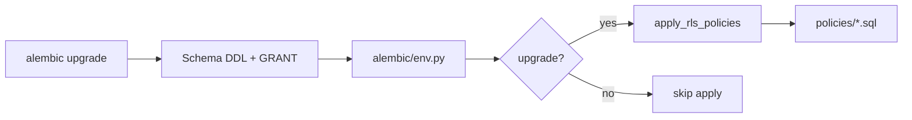
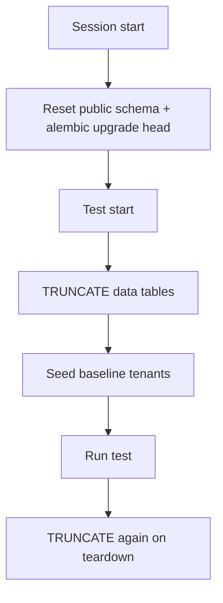

# Database RLS policies and integration testing

This document summarizes two related improvements: decoupling Row Level Security (RLS) from Alembic revisions, and isolating integration tests on a dedicated database with per-test reset.

## 1. RLS policies as idempotent scripts

### Problem

Tenant isolation requires `ENABLE ROW LEVEL SECURITY`, `FORCE ROW LEVEL SECURITY`, and a `tenant_isolation` policy on every tenant-owned table. Embedding that DDL in each Alembic revision duplicated policy text, blocked clean `alembic revision --autogenerate`, and mixed schema history with security policy.

### Solution

| Layer | Responsibility |
|-------|----------------|
| Alembic revisions | Tables, indexes, constraints, `GRANT` to `vaultlog_app` |
| `scripts/rls/policies/<table>.sql` | ENABLE, FORCE, DROP + CREATE policy per table |
| `alembic/env.py` | Apply policies after **upgrades only** |

### Layout

```
backend/scripts/rls/
  template.sql              # {{table}}, {{tenant_column}} placeholders
  new_policy.py             # CLI: copy template → policies/<table>.sql
  apply.py                  # Execute all policy files; TENANT_TABLES registry
  policies/
    organization.sql        # tenant key: id
    vault.sql               # tenant key: tenant_id
    membership.sql
```

Each policy file is idempotent:

```sql
ALTER TABLE … ENABLE ROW LEVEL SECURITY;
ALTER TABLE … FORCE ROW LEVEL SECURITY;
DROP POLICY IF EXISTS tenant_isolation ON …;
CREATE POLICY tenant_isolation ON … USING (…) WITH CHECK (…);
```

### Apply flow



- **Upgrades:** `apply_rls_policies(connection, strict=False)` runs in the same transaction. Missing tables are skipped with a warning (safe during partial downgrades if a policy file still exists).
- **Downgrades:** apply is not run. `DROP TABLE` removes policies with the table.
- **Standalone:** `uv run python -m scripts.rls.apply` re-applies all policies; fails if a policy file targets a missing table (`strict=True`).

### Adding a tenant-owned table

1. Autogenerate migration: schema + `GRANT` only (no RLS in the revision).
2. `uv run python -m scripts.rls.new_policy <table>` (or `--column id` for organization-style tables).
3. Add the table to `TENANT_TABLES` in `scripts/rls/apply.py`.
4. `uv run alembic upgrade head`.

Further detail: [scripts/rls/README.md](../scripts/rls/README.md), [ADR 0004](adr/0004-rls-policy-scripts.md).

---

## 2. Isolated, idempotent integration tests

### Problem

Integration tests used the development database (`vaultlog`), seeded data once per module with `ON CONFLICT DO NOTHING`, and auth tests committed rows without cleanup. Tests were not independent and could pollute local dev data.

### Solution

Integration tests always use **`vaultlog_test`** on the same Postgres instance. Each test gets a clean data snapshot via truncate + reseed.

### Test database provisioning

- **New Docker volumes:** `docker/postgres/init.sql` creates `vaultlog_test` and grants `CREATEDB` to `vaultlog_owner`.
- **Existing volumes:** `ensure_test_database` probes `vaultlog_test`; creates it via `vaultlog_owner` or the Compose bootstrap user (`postgres_bootstrap` by default).
- **Pytest guard:** `tests/conftest.py` sets `DATABASE_NAME=vaultlog_test` and refuses to run if the dev database name is resolved.

### Fixture architecture

```
tests/conftest.py                    # env override, pytest_plugins, dev-DB guard
tests/integration/conftest.py        # autouse db_reset
tests/integration/fixtures/
  constants.py                       # TENANT_A, TENANT_B, VAULT_A_ID
  database.py                        # ensure_test_database, owner_engine, app_engine
  migrations.py                      # DROP SCHEMA public CASCADE + upgrade head
  cleanup.py                         # truncate all tables except alembic_version
  seed.py                            # baseline organizations + vault
  sessions.py                        # scoped_session, identity UoW, auth use cases
```

### Per-test lifecycle



- `alembic_version` is **not** truncated, so Alembic state stays consistent across tests.
- Tests that commit (auth flows) leave no residue for the next test.
- `@pytest.mark.schema` skips `db_reset` for migration lifecycle tests.

### RLS migration lifecycle test

`tests/integration/test_rls_migration_lifecycle.py` verifies the RLS hook against real Alembic commands:

1. Assert at `head`: `membership` exists; `tenant_isolation` policies on all `TENANT_TABLES`.
2. `alembic downgrade` to initial revision → `membership` dropped; downgrade succeeds without policy re-apply.
3. `alembic upgrade head` → tables and policies restored.
4. Session teardown upgrades to `head` if the test left the schema behind.

Alembic CLI calls run in **sync** test code (`asyncio.run` only for DB assertions) to avoid `asyncio.run()` inside pytest’s event loop.

### Running tests

```bash
uv run pytest tests/unit -v          # no database
uv run pytest tests/integration -v   # vaultlog_test only
uv run pytest tests/ -v              # full suite
```

Further detail: [tests/integration/fixtures/README.md](../tests/integration/fixtures/README.md).

---

## Related documents

| Document | Topic |
|----------|--------|
| [migration-checklist.md](migration-checklist.md) | Checklist for migrations and policy scripts |
| [adr/0001-shared-postgresql-with-rls.md](adr/0001-shared-postgresql-with-rls.md) | RLS multi-tenancy decision |
| [adr/0004-rls-policy-scripts.md](adr/0004-rls-policy-scripts.md) | RLS scripts vs Alembic split |
